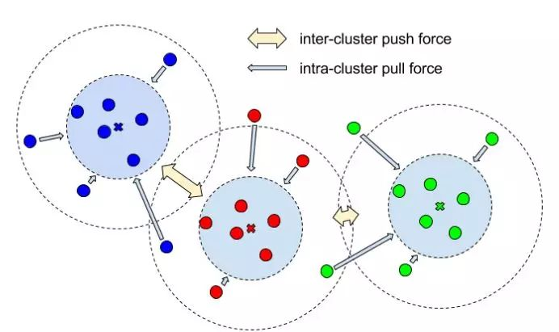
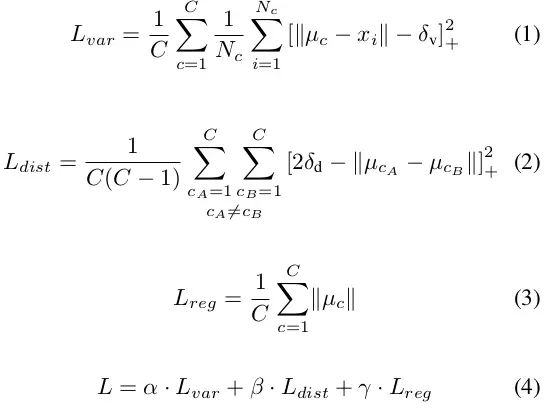
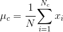

# lane-detection
+ 最近在做车道线检测、分割的工作，读到一篇十分不错的文章对此做下总结
- 首先点名推荐一篇IEEE IV 2018的优秀论文：[《LaneNet: Real-Time Lane Detection Networks for Autonomous Driving》](./1802.05591.pdf)
+ 这篇文章主要解决了车道切换以及车道数的限制的问题
- 实现方法是：通过训练神经网络进行端到端的车道检测，将车道检测作为实例分割问题来实现
+ 文章提出了 Lannet 网络结构，如下图：
 
+ Lanenet 使用一个共享的encoder，对输入图像进行处理，得到2个branch：嵌入branch和语义分割的branch。嵌入branch可以将不同的车道线区分为不同的instance；因为只需要考虑车道线，因此语义分割的结果是二值化图像；然后对2个branch做聚类，最终得到结果
-  通常情况下，车道像素被投影成“鸟瞰图”表示，使用一个固定的转换矩阵。然而，由于变换参数对所有图像都是固定的，所以当遇到非地面时，例如在斜坡上，这会引起一些问题。为了缓解这个问题，文章提出 H-Network，它可以估算输入图像上的“理想”透视变换的参数。

 + 基于学习方法的投影方法H-Net
 
    - 将输入的RGB图像作为输入，使用LaneNet得到输出的实例分割结果，然后将车道线像素使用H-Net输出得到的透视变换矩阵进行变换，对变换后的车道线像素在变化后的空间中进行拟合，再将拟合结果经过逆投影，最终得到原始视野中的车道线拟合结果

    * H-Net将RGB作为输入，输出为基于该图像的透视变换系数矩阵，优化目标为车道线拟合效果
    
+ 论文的整体计算流程图大致如下(草图)所示：
    
  

- 说到这篇端到端的车道线检测，不得不提的是这篇文章中用到的一个聚类loss，同样是这篇文章的作者发表的一篇文章[《Semantic Instance Segmentation with a Discriminative Loss Function》](./1708.02551v1.pdf)

+ 这篇文章最重要的是提出一个判别损失函数，其主要作用是：
    
    * 1.同instance内部像素的embedding vector在映射空间中要尽可能的临近（L1、L2距离）
    
    + 2.不同instance的mean embedding vector（即在映射空间中聚类的中心点）要尽可能的远离

- 即希望embedding vectors 在映射空间中的位置如下图所示：

 

+ 图中所示的intra-cluster pull force 即为上述条件1，inter-cluster push force即为上述条件2

* 为了满足这两个条件，文章进一步设计了Loss function。具体公式如下：

+ 其中

 * C代表groundtruth中instance数目，Nc代表某个instance中的像素个数。Xi 代表instance中第i个像素产生的embedding vector
  
 + 是groundtruth中该instance的所有像素对应的embedding vectors在映射空间中的中心（mean vector）。

 + 最后一项为正则项，目的是让映射空间中每个cluster（对应于instance）的中心与原点的距离不要过远。

 - 训练过程中使用ground truth作为instance mask。上述LOSS仅涉及同一类object的不同instance之间的聚类学习。如果要用到多类object，则需要分别对每个类计算LOSS并累加。
 
 + 关于这个 loss 笔者已用 Pytorch 实现 [dis_loss](./dic_loss.py)
